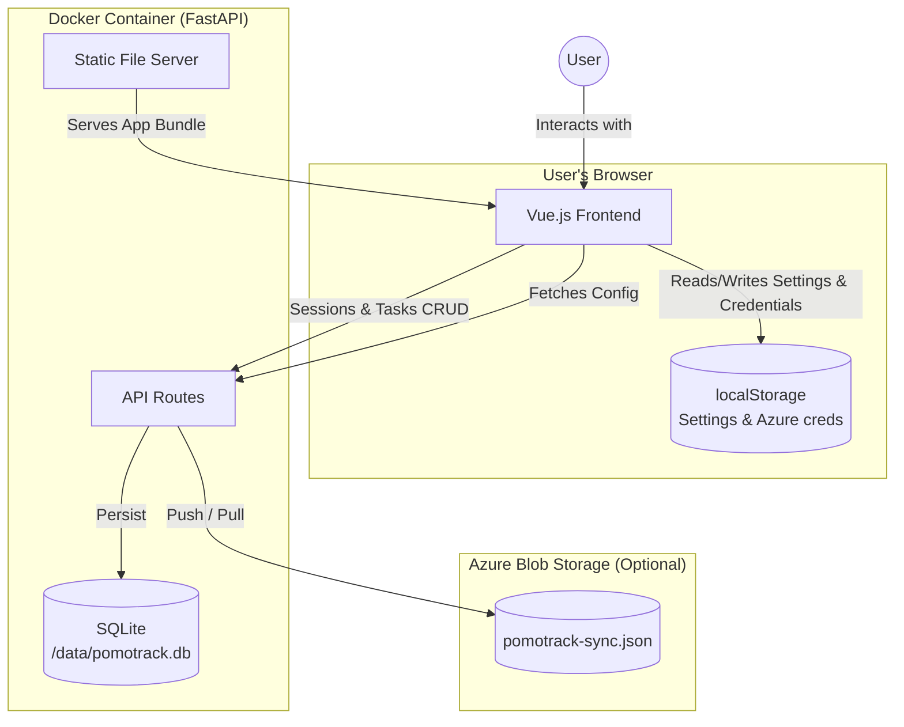

# Pomotrack

A self-hosted, single-user Pomodoro timer that is simple to use and run and nothing more.

> ⚠️ **Security Notice:** This application is designed for **local/LAN use only**. It has no authentication and should **not be exposed to the public internet**. If you need remote access, place it behind a VPN or authenticated reverse proxy.

## Features

### Timer

- 🍅 Standard Pomodoro workflow (Focus → Short Break → Long Break)
- ⚙️ Configurable timer durations
- 🔄 Auto-start next session (optional)
- ⏭️ Skip or reset current session
- ⚠️ Visual urgency warnings (optional pulsing at 2min/30sec remaining)

### Notifications & Alerts

- 🔔 Browser notifications on session completion
- 🔊 Audio alerts (bell sound)
- 📱 Keep screen awake during timer (Wake Lock API)

### Tracking & Stats

- 📊 Daily session statistics
- 🎯 Daily goal progress tracking
- 🏷️ Session labeling with presets and history
- 📈 End-of-day summary modal

### Kanban Board (Optional)

- 📋 Built-in task management with 3-column kanban (Todo → In Progress → Done)
- 🖱️ Drag-and-drop tasks between columns
- 🍅 Automatic pomodoro counting per task
- 💾 Tasks and sessions persisted in SQLite (survives container restarts)

### Cloud Sync (Optional)

- ☁️ Manual push/pull sync to Azure Blob Storage
- 🔄 Sync sessions and kanban tasks between multiple computers
- 🔑 Azure credentials stored locally in the browser, never committed to source control
- 🚀 Bootstrap a new machine by pulling from the cloud

### Interface

- 🌙 Dark/Light theme toggle
- 📐 Compact mode for smaller displays
- ⌨️ Keyboard shortcuts (Space, S, R, Escape)
- 🔖 Dynamic favicon showing timer progress
- 💾 Settings and preferences persist in localStorage

## Quick Start

### Using Docker Compose (Recommended)

```bash
docker compose up -d
```

Open http://localhost:8080 in your browser.

Session history and kanban tasks are stored in a SQLite database in a named Docker volume (`pomotrack-data`). Data persists across container restarts and image updates.

### LAN Access

To access from other devices on your network, the app listens on all interfaces. Access via your machine's IP address (e.g., http://192.168.1.100:8080).

### Development Setup

**Prerequisites:**

- Python 3.11+
- Node.js 20+
- uv (Python package manager)

**Backend:**

```bash
cd backend
uv sync
uv run uvicorn app.main:app --reload --port 7070
```

**Frontend:**

```bash
cd frontend
npm install
npm run dev
```

Open http://localhost:5173 for development (with hot reload). The Vite dev server proxies `/api` requests to the backend at port 7070.

## Keyboard Shortcuts

| Key      | Action                |
| -------- | --------------------- |
| `Space`  | Start/Pause timer     |
| `S`      | Skip to next session  |
| `R`      | Reset current session |
| `Escape` | Close modals          |

## Architecture



### Project Structure

```
pomotrack/
├── backend/           # FastAPI backend
│   └── app/
│       ├── main.py       # App entry point, static file serving & DB init
│       ├── database.py   # Async SQLite engine & session dependency
│       ├── models.py     # SQLModel table definitions
│       └── api/
│           └── routes.py # REST endpoints (sessions, kanban, sync)
├── frontend/          # Vue 3 + TypeScript frontend
│   └── src/
│       ├── api/           # Typed fetch wrappers (sessions, kanban, sync)
│       ├── components/    # UI components
│       └── composables/   # Timer logic, storage, kanban, session history, sync
├── Dockerfile         # Multi-stage build (Node + Python)
└── docker-compose.yml # Single-container deployment with named data volume
```

## Design Decisions

- **Timer runs in browser**: All timer state is client-side for simplicity and offline capability
- **Settings persist in localStorage**: Timer config, theme, and preferences stay in the browser
- **Sessions & tasks in SQLite**: Stored server-side so data survives browser clears and is accessible from any client on the LAN
- **Single container**: Frontend is built and served by FastAPI; the SQLite database lives in a named Docker volume at `/data/pomotrack.db`
- **Optimistic UI updates**: The frontend updates local state immediately; API calls fire in the background
- **Cloud sync is optional and manual**: Azure credentials are stored only in the browser's localStorage and are sent to the backend only when you initiate a push or pull — they are never stored server-side or committed to source control
- **No authentication**: Designed for single-user, LAN-only deployment

## Configuration

Default timer settings (configurable via ⚙️ Settings):

| Setting          | Default | Description                |
| ---------------- | ------- | -------------------------- |
| Focus duration   | 25 min  | Length of focus sessions   |
| Short break      | 5 min   | Length of short breaks     |
| Long break       | 15 min  | Length of long breaks      |
| Long break after | 4 🍅    | Pomodoros until long break |
| Daily goal       | 8 🍅    | Target pomodoros per day   |

### Behavior Settings

| Setting           | Default | Description                           |
| ----------------- | ------- | ------------------------------------- |
| Auto-start breaks | Off     | Automatically start break after focus |
| Auto-start focus  | Off     | Automatically start focus after break |
| Keep screen on    | Off     | Prevent screen sleep during timer     |

### Alert Settings

| Setting         | Default | Description                   |
| --------------- | ------- | ----------------------------- |
| Sound           | On      | Play sound when session ends  |
| Notifications   | Off     | Show browser notification     |
| Urgency warning | On      | Visual pulse near session end |

### Display Settings

| Setting      | Default | Description                                       |
| ------------ | ------- | ------------------------------------------------- |
| Theme        | Dark    | Dark or Light mode                                |
| Compact mode | Off     | Smaller timer for limited space                   |
| Kanban board | Off     | Enable task kanban board (replaces session label) |

## Cloud Sync

Pomotrack can optionally sync session history and kanban tasks to Azure Blob Storage, allowing you to share data between multiple computers each running their own local Docker container.

### Setup

1. Create an Azure Storage account and a container (e.g. `pomotrack`)
2. Obtain the storage account **Access Key** (not a SAS token) from the Azure portal
3. Open the Pomotrack **Settings** panel → **Cloud Sync** section
4. Enter your **Account Name**, **Container Name**, and **Access Key**

Credentials are stored only in your browser's localStorage and are sent to the backend only when you push or pull.

### Usage

| Button   | Action                                                                |
| -------- | --------------------------------------------------------------------- |
| ☁️↑ Push | Uploads all sessions and tasks as `pomotrack-sync.json` to Azure Blob |
| ☁️↓ Pull | Downloads the blob, replaces all local data, and reloads the page     |

> **Note:** Pull overwrites all local data. Always push from the source machine before pulling on another.

### Bootstrap a new machine

On a fresh installation, enter your Azure credentials in Settings, then click **☁️↓ Pull** to restore all data from the cloud.

### Security

- Credentials are never stored server-side or written to disk
- Sync traffic goes over HTTPS to Azure
- The blob is private; access requires the account key

## Browser Support

- Chrome/Edge (latest) - Full support including Wake Lock
- Firefox (latest) - All features except Wake Lock
- Safari (latest) - All features except Wake Lock

## License

Do whatever you want with it.
